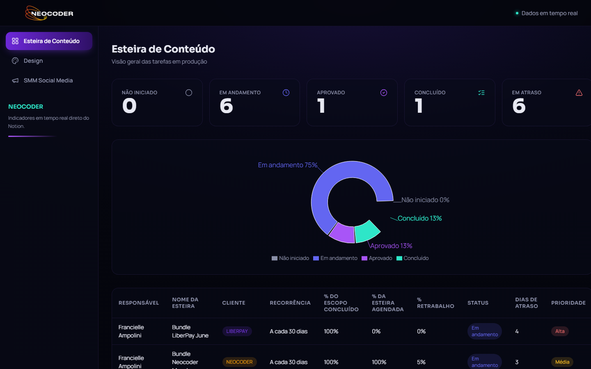
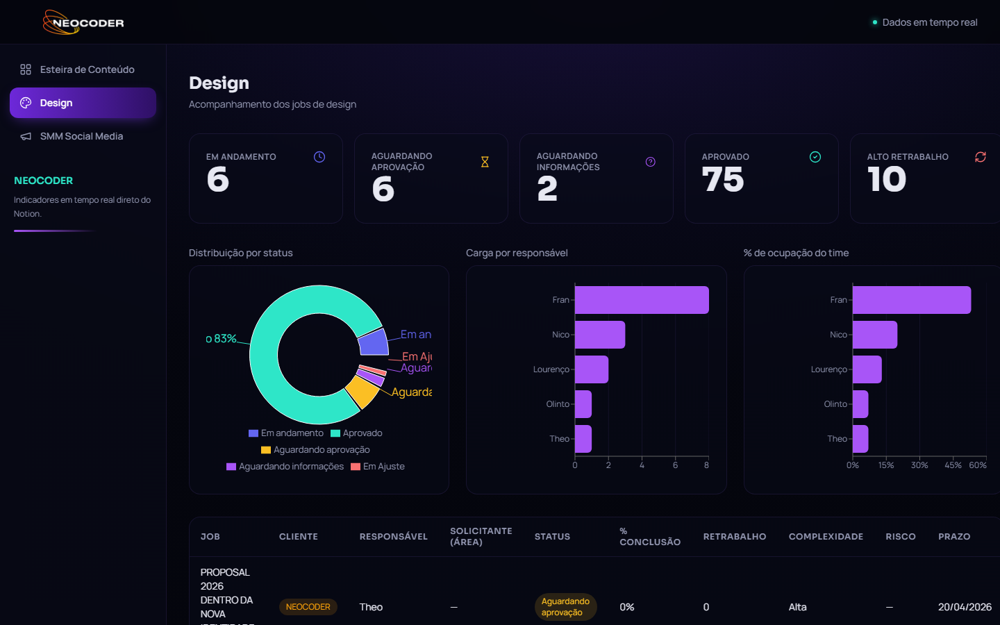
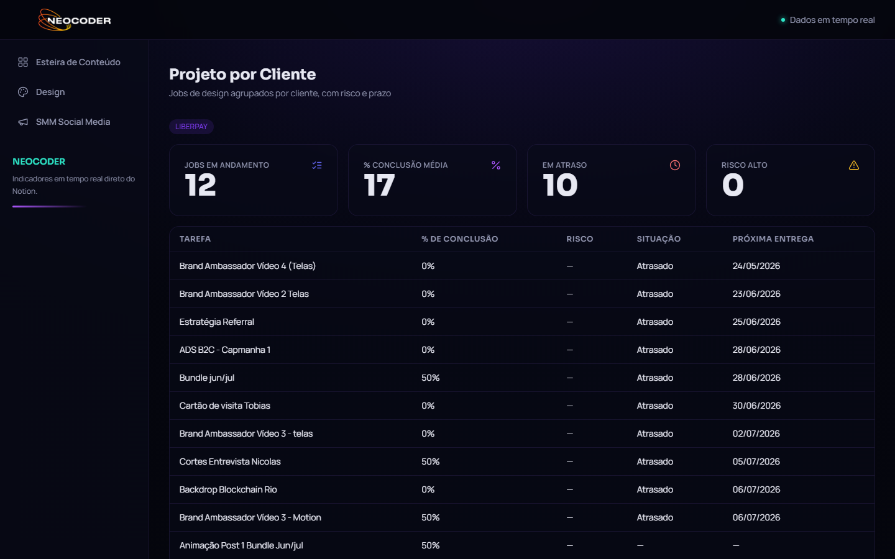
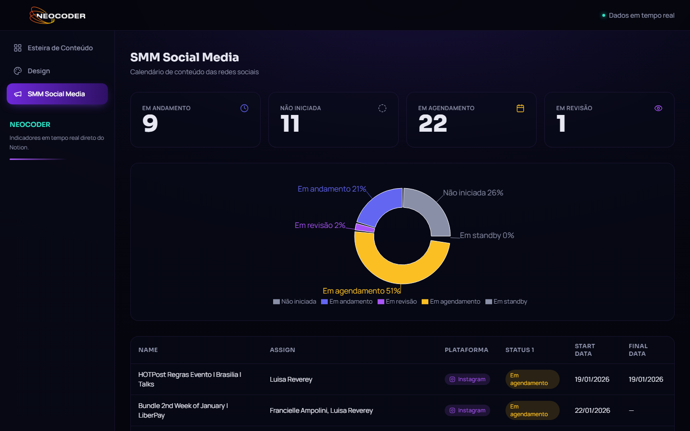

# Neocoder Dash

Dashboard de gestão executiva da Neocoder. Consolida em um único lugar os indicadores que hoje vivem espalhados em databases do Notion — Esteira de Conteúdo, Design e SMM — com scorecards, gráficos e tabelas atualizados em tempo real, sem precisar abrir o Notion para acompanhar o andamento do trabalho.

Construído com Next.js (App Router) + TypeScript, puxando dados diretamente da API do Notion no servidor a cada requisição.

## Sumário

- [Sobre o projeto](#sobre-o-projeto)
- [Screenshots](#screenshots)
- [Tecnologias](#tecnologias)
- [Estrutura do projeto](#estrutura-do-projeto)
- [Como rodar localmente](#como-rodar-localmente)
- [Configurando a integração com o Notion](#configurando-a-integração-com-o-notion)

## Sobre o projeto

O dashboard tem 3 áreas principais, cada uma espelhando uma database do Notion usada pelo time:

- **Esteira de Conteúdo** — programas/bundles de conteúdo recorrente por cliente: status, % de escopo concluído, % já agendado, retrabalho e atraso.
- **Design** — jobs de design em andamento: cliente, solicitante, complexidade, risco, retrabalho e prazo, com gráfico de distribuição por status e de ocupação do time.
- **SMM Social Media** — calendário de conteúdo das redes sociais: plataforma, status e datas de agendamento/entrega.

Existe ainda uma quarta tela, **Projeto por Cliente**, que agrupa os jobs de Design por cliente (LiberPay, Neocoder, Kotai) com risco e situação de prazo — hoje desativada do menu (o código continua no projeto, comentado em `components/Sidebar.tsx`) até que Esteira e SMM também tenham um campo de Cliente confiável.

Cada página é composta por:
- **Scorecards** — números grandes por status/categoria
- **Gráficos** — pizza (distribuição por status) e barras (carga/ocupação por pessoa), feitos com Recharts
- **Tabela** — lista detalhada, ordenada pelo mais urgente/atrasado primeiro

Os dados são buscados direto da API oficial do Notion (`@notionhq/client`) em Server Components, com revalidação automática a cada 60 segundos.

## Screenshots

### Esteira de Conteúdo



### Design



### Projeto por Cliente



### SMM Social Media



## Tecnologias

| Categoria | Tecnologia |
|---|---|
| Framework | [Next.js 14](https://nextjs.org/) (App Router, Server Components) |
| Linguagem | [TypeScript](https://www.typescriptlang.org/) |
| Estilização | [Tailwind CSS](https://tailwindcss.com/) |
| Fontes | [Sora](https://fonts.google.com/specimen/Sora) (títulos/KPIs, pesos 600–800) + [Manrope](https://fonts.google.com/specimen/Manrope) (texto corrido, pesos 400–600), via `next/font/google` |
| Gráficos | [Recharts](https://recharts.org/) |
| Ícones | [lucide-react](https://lucide.dev/) |
| Fonte de dados | [Notion API](https://developers.notion.com/) via `@notionhq/client` |
| Utilitários de classe | `clsx` + `tailwind-merge` (helper `cn`) |

Não há banco de dados próprio — o Notion é a única fonte de verdade, consultada a cada carregamento de página.

## Estrutura do projeto

```
app/
  esteira/page.tsx      Página Esteira de Conteúdo
  design/page.tsx        Página Design
  clientes/page.tsx       Página Projeto por Cliente (desativada do menu)
  smm/page.tsx            Página SMM Social Media
  layout.tsx              Layout raiz (fontes, Topbar, Sidebar)
  globals.css             Reset + fundo em gradiente

components/
  Card.tsx                Wrapper com efeito spotlight (segue o mouse)
  Sidebar.tsx             Navegação lateral
  Topbar.tsx              Cabeçalho fixo (logo + status)
  Scorecard.tsx           Card de número grande (KPI)
  Badge.tsx               Badges coloridos por status/cliente/risco/plataforma
  DataTable.tsx           Tabela genérica com colunas configuráveis
  StatusPieChart.tsx      Gráfico de pizza (distribuição por status)
  WorkloadBarChart.tsx    Gráfico de barras (carga/ocupação)
  PageHeader.tsx          Título + descrição de cada página

lib/
  notion.ts               Cliente do Notion + helpers de leitura de propriedades
  esteira.ts              Normalização e agregações da Esteira
  design.ts               Normalização e agregações do Design
  smm.ts                  Normalização e agregações do SMM
  utils.ts                Helper cn() (clsx + tailwind-merge)

types/
  index.ts                Tipos compartilhados (status, itens, etc.)
```

## Como rodar localmente

Pré-requisitos: Node.js 18+ e uma integração do Notion já configurada (veja a seção abaixo).

```bash
npm install
cp .env.example .env.local   # e preencha o NOTION_TOKEN
npm run dev
```

O app sobe em `http://localhost:3000` (use `npm run dev -- -p 3010` para rodar em outra porta, caso a 3000 já esteja em uso).

Outros scripts disponíveis:

```bash
npm run build   # build de produção
npm run start   # sobe o build de produção
npm run lint    # eslint
```

## Configurando a integração com o Notion

1. Crie uma integração interna em [notion.so/my-integrations](https://www.notion.so/my-integrations) e copie o token gerado para `NOTION_TOKEN` no `.env.local`.
2. Em cada database do Notion que o dashboard precisa ler (Esteira, Design, SMM), abra o menu `•••` → **Connections** → adicione a integração criada.
3. Os IDs das databases ficam em `lib/notion.ts` (`DATABASE_IDS`). Se você for apontar para databases diferentes, copie o ID da URL de cada uma e atualize esse arquivo.

Sem esse compartilhamento, as chamadas à API retornam `object_not_found` mesmo com o token correto — é o erro padrão do Notion quando o recurso existe mas a integração não tem acesso a ele.
